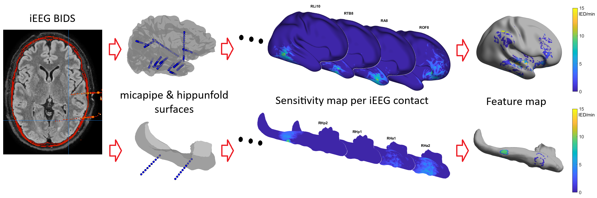
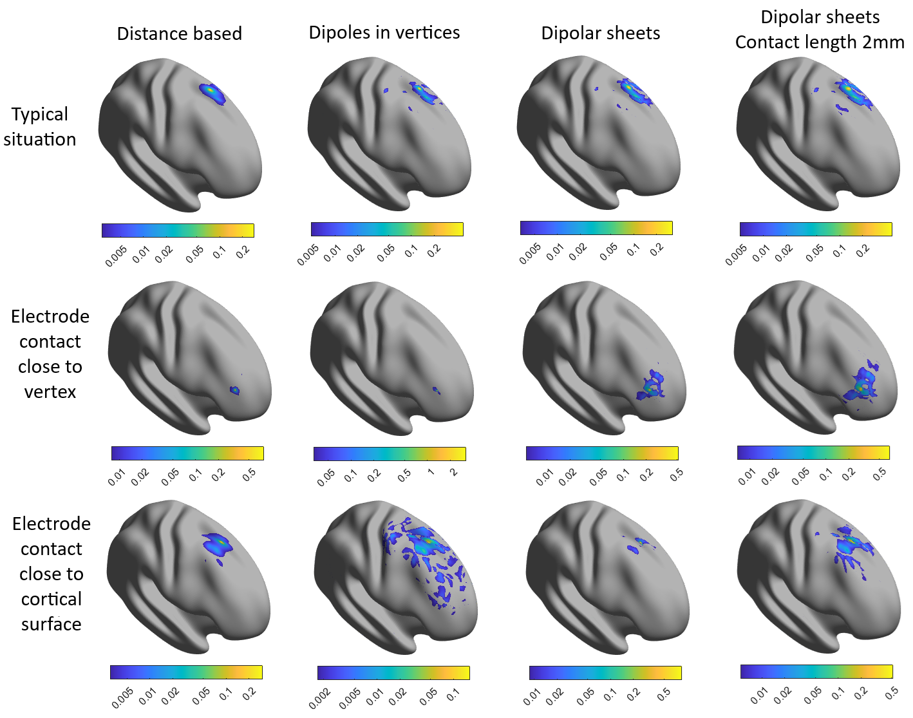
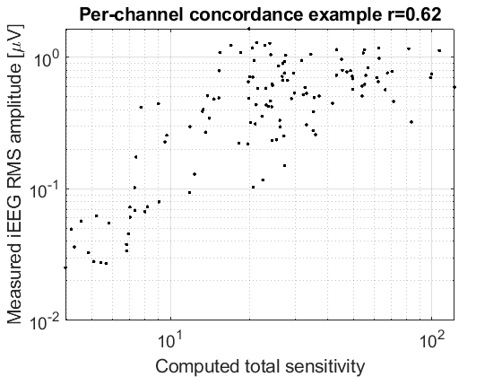
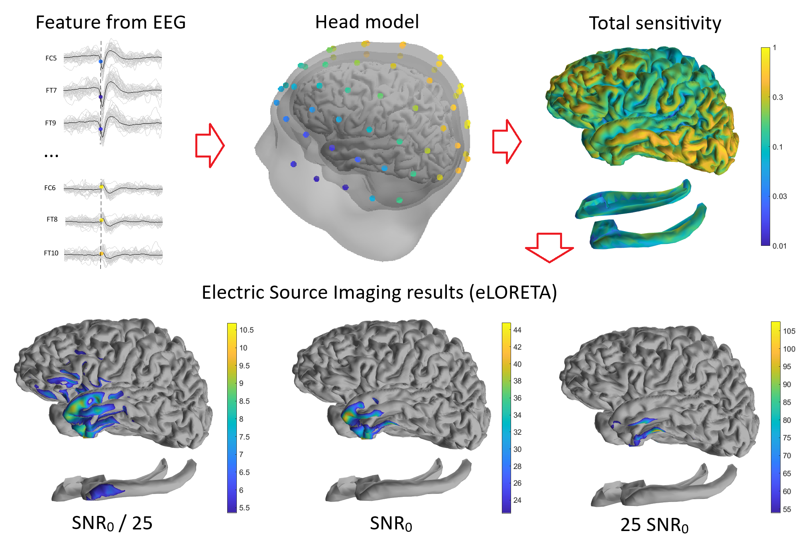

.. _algorithm:

Algorithms and Mathematical Background
=======================================

Overview
--------

`electroMICA` projects electrophysiological features (scalp or intracranial EEG) 
onto cortical and hippocampal surfaces using forward and inverse modeling techniques 
based on the Boundary Element Method (BEM).

Intracranial EEG (iEEG) Method
------------------------------

**Problem Setup**

Depth electrodes (intracranial recordings) are modeled as line segments 
embedded in a volume conductor. The brain is approximated as a **homogeneous single-layer conductor** 
(to first approximation; more complex models can be used if needed).

**Contact Sensitivity Profiles**

The core computation is the **contact sensitivity profile** — also called the **leadfield** — which 
quantifies how electrical activity at each point on the cortical surface contributes to the 
measured potential at each electrode contact.

Given:
- Contact position: :math:`\mathbf{r}_k`
- Cortical surface: mesh with vertices :math:`\{\mathbf{r}_i\}`
- Conductivity: :math:`\sigma` (homogeneous)

The forward problem is formulated using the **Boundary Element Method**:

**Analytic Element Integration**

To improve accuracy, `electroMICA` uses **analytically integrated basis functions** 
over triangular surface elements (rather than numerical quadrature). This follows the approach in:

   de Munck, J. C. (1992). A linear discretization of the volume conductor boundary integral 
   equation using analytically integrated elements. IEEE Trans Biomed Eng, 39(10), 986–990.

Each triangular element's contribution is computed analytically, improving both speed and accuracy.

**Feature Mapping**

Once the sensitivity profiles are computed, a feature value (e.g., spike rate, power, etc.) 
at each contact is mapped to the cortical surface as:

**Thresholding**

To suppress noisy projections, two thresholds are applied:

1. **Channel threshold** (``ChanTresh``): Contacts contributing < threshold are ignored.
2. **Global threshold** (``GlobalTresh``): Vertices with total sensitivity < threshold are masked out.

Scalp EEG Method
----------------

**Problem Setup**

Scalp EEG recordings measure electrical activity from electrode contacts placed on the scalp. 
Unlike iEEG, we must model the **three-layer head** (scalp, skull, brain) and account for 
conductivity differences between layers.

**Three-Layer Head Model**

The head model is derived from the subject's T1-weighted MRI:

1. **Outer boundary** (scalp surface)
2. **Middle boundary** (skull surface) — derived from the brain mask
3. **Inner boundary** (brain/cortical surface)

Conductivity values (typically):
- Scalp: :math:`\sigma_{\text{scalp}} = 0.33` S/m
- Skull: :math:`\sigma_{\text{skull}} = 0.015` S/m
- Brain: :math:`\sigma_{\text{brain}} = 0.33` S/m

**Forward Problem: BEM Solution**

The forward problem is: "Given a source distribution on the cortex, what are the 
resulting potentials at the scalp?"

Using BEM with three layers, a linear system is solved.
The **leadfield matrix** :math:`K` maps cortical source activity to scalp potentials:

**Inverse Problem: eLORETA with Spatial Correlation**

Given measured scalp EEG features, we estimate the underlying cortical source distribution.
A standard inverse method (eLORETA-like) is with a **non-diagonal weighting matrix** is constructed to penalize spatially uncorrelated solutions,
encouraging smooth, realistic source patterns.

**Multiple SNR Variants**

Five feature maps are computed for SNR levels: very high, high, medium, low, very low (in 7 dB steps).
Different regularization parameters are used for each SNR level, allowing flexibility in interpretation.

Hippocampal Integration
-----------------------

When `hippunfold <https://hippunfold.readthedocs.io>`_ outputs are available, 
the hippocampal midthickness surface is added to the source space:

- For **iEEG**: Hippocampal surface is included in the sensitivity profile computation.
- For **scalp EEG**: Hippocampal vertices are added to the leadfield matrix rows.

This allows features to be projected onto hippocampal subfields (CA, DG, subiculum, etc.) 
in addition to the main cortex.

Output Files
~~~~~~~~~~~~

The pipeline generates:

- **Leadfield/Sensitivity matrices** (`.mat`): Contains the :math:`K` matrix and metadata
- **Feature maps** (`.gii` GIFTI): Vertex-wise projected features

References
----------

Key papers and methods:

1. **BEM Formulation**:
   - de Munck, J. C. (1992). IEEE Trans Biomed Eng, 39(10), 986–990.

2. **eLORETA**:
   - Pascual-Marqui, R. D. (2002). Standardized low-resolution brain electromagnetic tomography (sLORETA).
     Methods Find Exp Clin Pharmacol, 24(Suppl D), 5–12.

3. **Intracranial EEG Imaging**:
   - Lachaux, J.-P., et al. (2003). Nat Rev Neurosci, 4(5), 369–380.

4. **Head Modeling in EEG**:
   - Hallez, H., et al. (2007). J Neuroeng Rehabil, 4, 46.

See Also
--------

- :ref:`usage` — Practical usage examples
- :ref:`api` — Function reference
