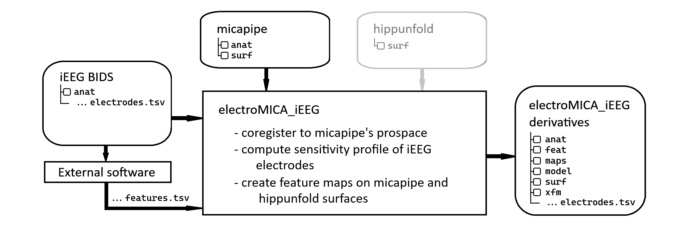

[`electroMICA`](electroMICA.readthedocs.io) is developed by [MICA-lab](https://mica-mni.github.io) at McGill University for use at [the Neuro](https://www.mcgill.ca/neuro/), McConnell Brain Imaging Center ([BIC](https://www.mcgill.ca/bic/)).  
> The main goal of this pipeline is to provide a robust framework to integrate electrophysiological data and information derived from a varied modality of MR images.    
> `electroMICA` relies on the output of `micapipe,` developed in our laboratory.
> The basic cutting edge processing of our pipelines aims at the *scalp EEG*, and *intracerebral EEG*, or *stereo EEG*.

## Documentation ##
You can find the documentation in [electroMICA.readthedocs.io](http://electroMICA.readthedocs.io/en/latest/)

## Reference ##
Not available yet.

## Workflow ##
Intracerebral EEG: electroMICA_iEEG

Scalp EEG: electroMICA_scalp

## Advantages ##
-   Appropriate modelling of electrode and geneartor for intracranial EEG.
-   Subject speific head model generation ofr scalp EEG.  
-   Surface based analysis including hippocampus.  
-   Ready to use outputs.  
-   Easy to use.  
-   Standardized format (BIDS).  

## Dependencies ##
- [`micapipe`](micapipe.readthedocs.io) must be run before electroMICA.
- electroMICA accepts [`hippunfold`](hippunfold.readthedocs.io) output surfaces.

### `python` mandatory packages `conda` ###
|       *Package*        |  *Version* |
|------------------------|------------|
| nibabel                |  4.0.2     |
| numpy                  |  1.21.5    |
| pandas                 |  1.4.4     |
| scipy                  |  1.7.3     |
| antspyx                |  0.3.0     |
